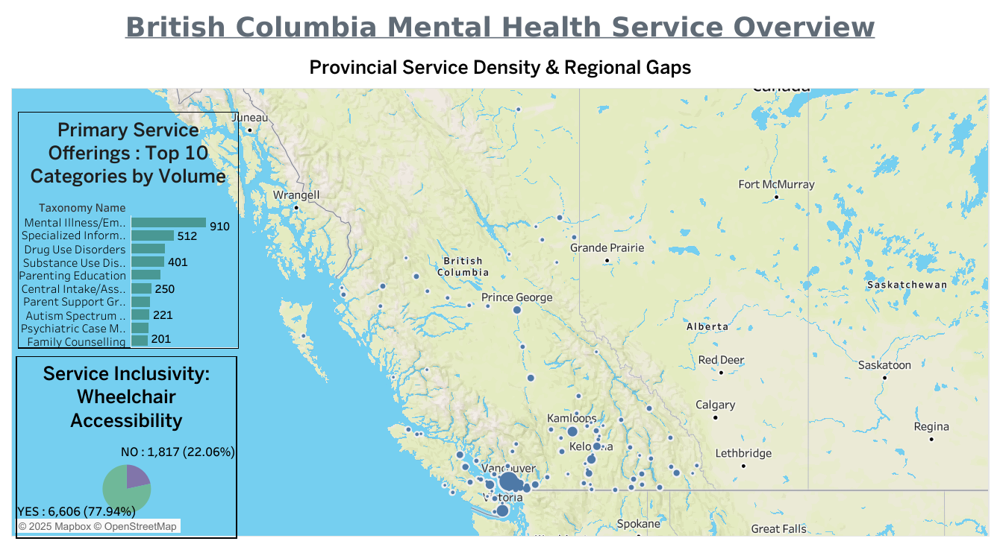

# British Columbia Mental Health Service Analysis

##  [View Live Dashboard Here](https://public.tableau.com/app/profile/ashima.sethi/viz/BCMentalHealthServiceOverview/BCMentalHealthServiceOverview)

##  Project Overview
This project analyzes the landscape of Mental Health and Substance Use (MHSU) services across BC. Using a dataset of over 5,000 records, I identified key service gaps and accessibility barriers to help visualize where resources are most needed.

##  Dashboard Preview

##  Problem Statements & Insights

### 1. Service Volume (The "What")
* **The Problem:** What are the most common services in the province?
* **Insight:** Mental Illness/Emotional Disabilties and "Information and Referral" make up the bulk of the system, suggesting a heavy focus on general support and system navigation.

### 2. Geographic Distribution (The "Where")
* **The Problem:** Is help distributed fairly, especially in rural areas?
* **Insight:** The map confirms heavy centralization in the Lower Mainland. Rural areas face "service deserts," particularly for specialized care like Eating Disorders.

### 3. Accessibility (The "How")
* **The Problem:** Are programs physically inclusive for wheelchair users?
* **Insight:** Approximately 22% of service locations are confirmed as NOT wheelchair accessible, representing a significant barrier to the "personal empowerment" goal of the system.

##  Technical Toolkit

###  Data Cleaning & Preparation (SQL)
* **MySQL Workbench:** Used as the primary tool for data transformation and quality assurance.
* **Cleaning Workflow:**
  * **Standardization:** Used SQL queries to standardize inconsistent city names, ensuring 100% accuracy for geographic mapping in Tableau.
  * **Duplicate Removal:** Identified and removed redundant service records
  * **Null Handling:** Identified and managed `NULL` values in the Accessibility fields to prevent skewed percentages in the final report.
  * **Data Validation:** Verified record counts and service categories after the import to maintain data integrity.

### Visualization (Tableau)
* **Tableau Public:** Developed an interactive "Heads-Up Display" dashboard to visualize the cleaned dataset.
* **Geocoding:** Leveraged the cleaned city data to map provincial service density across British Columbia.
